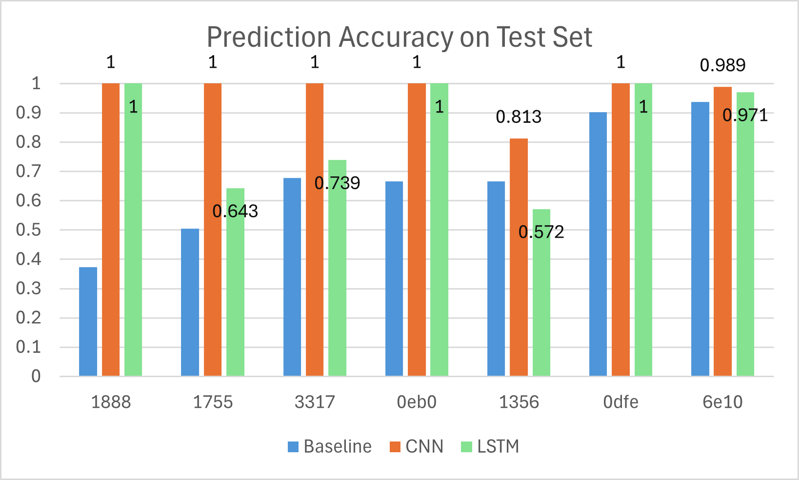
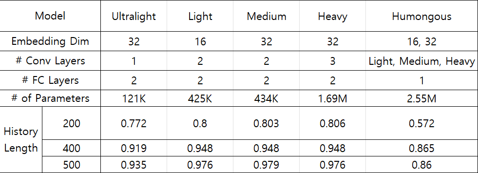
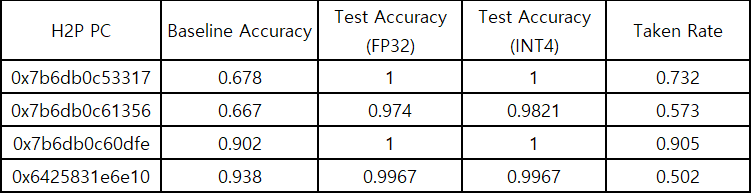
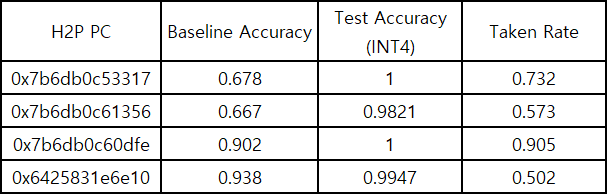

# Branch_Prediction

This repository contains the necessary source code to collect data, train and test a neural branch predictor. 
For this project, the open-source PARSEC benchmark suite has been used. However, this choice is arbitrary and 
any benchmark suite that can be run on a Linux environment will suffice. </br>
Link to Google Colab: [Google Colab](https://colab.research.google.com/drive/1y80vUay6G4ODE98Qa-TvsIEQZ01NCO5x?usp=sharing) </br>
Link to Final Report: [Final Paper]()

## Getting Started 

First, clone this repository to your local environment.

```
git clone https://github.com/Minchan-Kwon/Branch_Prediction.git
```

### Installing Intel Pin

The project pipeline starts by collecting branch data that the predictor can train and test on. 
To collect data from a benchmark execution, the user should first download Intel Pin - a binary instrumentation tool letting the user analyze the execution of a program. </br>
You can download the toolkit [here](https://www.intel.com/content/www/us/en/developer/articles/tool/pin-a-binary-instrumentation-tool-downloads.html).</br>
Ensure that the working Linux environment is set up for C++ development. 

Details on how to set up the Pin tool is written **[here](./tools/README.md)**

### Running PARSEC

The SPEC benchmarks are a de facto industry standard and many researchers have used it for various reasons. 
Unfortunately, they are quite expensive to purchase unless you belong to an accredited academic institution. 
Therefore, I have used the open source PARSEC benchmark to collect branch traces. However, any benchmark or program will be compatible with the provided Pin tool. </br>
The original website PARSEC was published in is now unavailable; however, there are mirrors that can be found [here](https://github.com/cirosantilli/parsec-benchmark.git) and also [here](https://github.com/bamos/parsec-benchmark.git).
After installing PARSEC, you can collect branch traces of the parsec binaries using the Pin tool. 

### Installing Requirements

Any user must install the Python requirements to successfully run this project locally. Enter the following command to install prerequisites.

```
python3 -m venv myenv

source myenv/bin/activate

pip install -r requirements.txt
```

### Executing the Pipeline

Running this command will display the positional subcommands required to run each pipeline stage.

```
python run_pipeline.py -h
```

Running the command below will display the command line options for each pipeline stage.

```
python run_pipeline.py <pipeline_stage> -h
```

A description of each pipeline stage is written below. 

**1. predict_baseline**

Usage:
```
python run_pipeline.py predict_baseline --csv <Path/to/CSV>
```

This pipeline stage will print stats of the global history and then make predictions on the branch history using a 2-bit saturating counter as the baseline model. The predictions will be saved to 'PROJECT_ROOT/data'. </br> </br>
The user should use this prediction result to identify branches to train the model on. A rule of thumb is to choose a PC with more than 1000 occurrences to ensure a big enough training dataset.  


**2. extract_branch_history**

Usage:
```
python run_pipeline.py extract_branch_history --csv <Path/to/CSV> --pc <hex> \
                       --length <int> --cutoff <int> --max_history <int> --batch <int>
```

Running this pipeline stage will create and save trainable history segments, its corresponding labels and metadata to be used in the remaining pipeline stages. </br>
If a PC is given, the script will search through the global branch history CSV to extract history segments of the given length (i.e. previous branch PCs leading up to the given PC). When 'cutoff' is specified, only the specified number of LSBs of the PCs will be collected. Specifiying 'max_history' will tell the script the maximum number of history segments to collect, and 'batch' is passed on to the next stages through the metadata file. 


**3. train**

Usage:
```
python run_pipeline.py predict_baseline --data_dir <Directory/to/data_folder> --model <str> \
                       --epoch <int> --lr <float> --device <str> --patience <int>
```

This stage temporally splits the collected branch histories, creates dataloaders, and finally trains and tests the model. A temporal split is used to simulate real world applications where past branches are used to train the model, which then predicts unseen, future branches.   </br> </br>
The 'data_dir' option requires a directory to the data folder. This directory is displayed at the end of the 'extract_branch_history' stage. It should be a directory that contains the history segments, labels, and metadata of a given PC and should look something like 'PROJECT_ROOT/run/data/0x...'. </br>
The option 'model' is a string. The user should choose from 'ultralight', 'light', 'medium', 'heavy', 'humongous' and 'lstm'. The adjective forms are all complexities of the CNN model. The LSTM has 1M more parameters than the medium sized CNN. </br>
'epoch', 'lr' represent the number of epochs and learning rate respectively. The default value for them are 50 and 0.001 respectively. 'device' is the device type training will be executed on, commonly 'cuda' or 'cpu', but other options exist. 'patience' is the number of epochs to stop training after the loss has plateaued. 


**4. qtrain**

Usage:
```
python run_pipeline.py predict_baseline --data_dir <Directory/to/data_folder> --model <str> \
                       --epoch <int> --lr <float> --device <str> --patience <int>
```

This pipeline stage is almost identical to the 'train' stage except for two key aspects. </br> Using the torchao library, it first performs Quantization-Aware-Training (QAT). QAT works by simulating the effects of low-precision arithmetic during training (forward pass and backpropagation). The model is encouraged to learn weights with the awareness of reduced numerical precision. It then converts the final parameters to INT4 precision, reducing the capacity of the model's parameters significantly while maintaining accuracy. 
</br></br>Users cannot specify 'lstm' for the 'model' option in this stage as it was discovered early on that LSTMs were inferior to CNNs in branch prediction. I simply did not try quantizing LSTMs in this project. 

## Results

**0. Choosing H2P (Hard-to-Predict) branches**

PCs with an accuracy of less than 95% and occurrence over one thousand were chosen as a suitable PC to train on.  The baseline prediction result was used to choose these branches. 

**1. CNN vs LSTM**


The figure above illustrates the prediction accuracies of the medium sized CNN and LSTM (which has 1M more parameters than the CNN). The LSTM was at most, on par with the CNN. 

**2. Hyperparameter Tuning with CNN**



This table shows how each model was composed. The 'humongous' model is an ensemble model, combining the predictions of the 'light', 'medium' and 'heavy' CNNs in the final linear layer. You can see that this model performed terribly compared to its components. </br> It's also clear that the number of parameters play a small role in deciding a model's accuracy. Although there are improvements in accuracy as the model gets bigger, the history length is the most impactful factor in determining prediction accuracy. 


**3. Performance of Quantized Models**



The parameters are quantized using torchao's Int8DynActInt4WeightQATQuantizer. As the name suggests, the activation is quantized to INT8 and the weights are quantized to INT4. </br>
Using history length of 500 and the medium CNN, quantization reduced the model's capacity from 3.96MB to 1.28MB while preserving, or even slightly improving accuracy.

**4. Testing on New Data**



Training and hyperparameter tuning was done using the simsmall input file for the *blackscholes* program. Additional branch traces were collected using the simmedium input file, and the same data-processing pipeline was applied. </br>
The table above shows the test accuracy of the INT4-quantized CNN on this previously unseen dataset, showing that the model achieves similarly strong performance.